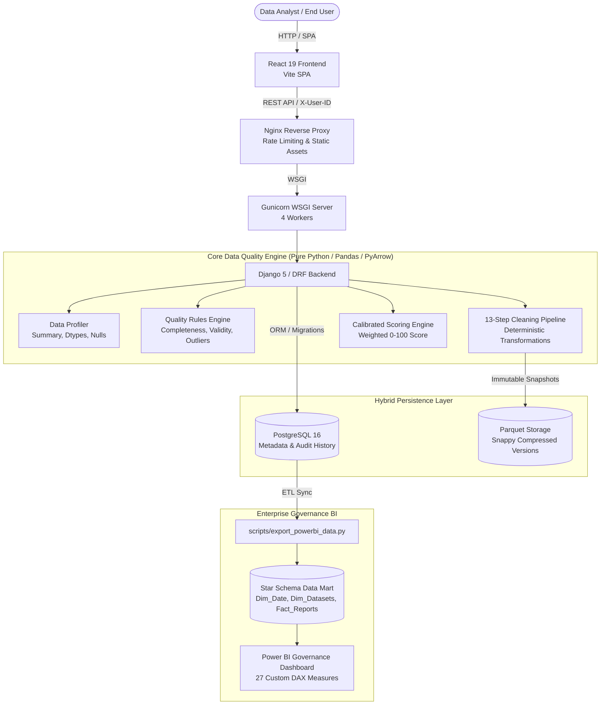

# Data Quality & Cleaning Platform

<div align="center">

[](https://www.python.org/)
[](https://www.djangoproject.com/)
[](https://react.dev/)
[](https://www.postgresql.org/)
[](https://powerbi.microsoft.com/)
[](https://docs.pytest.org/)
[](LICENSE)

**An enterprise-grade, end-to-end platform for automated data profiling, multi-dimensional quality scoring, deterministic cleaning, version lineage, and Power BI governance.**

</div>

---

## 📌 The Problem

> **"Can I trust this dataset before I analyze it?"**

In data analysis and machine learning, **over 80% of time is spent discovering and fixing messy, dirty, or corrupted data**. Missing values, outliers, duplicate records, non-standardized formats, and silent formula injections lead to flawed metrics, misleading visualizations, and broken downstream pipelines.

## 💡 The Solution

The **Data Quality & Cleaning Platform** delivers an automated, audit-ready data quality workflow:
1. **Instantly profiles** raw tabular data (CSV, XLSX, XLS).
2. **Detects quality violations** across 6 core dimensions (Completeness, Validity, Consistency, Uniqueness, Ranges, Outliers).
3. **Calculates a calibrated Quality Score** (0–100 scale).
4. **Applies configurable, deterministic cleaning transformations** with zero risk of data loss.
5. **Maintains immutable version history** using Snappy-compressed Apache Parquet snapshots.
6. **Defends against security threats** (MIME/magic-byte spoofing, path traversal, IDOR, and CSV formula injection).
7. **Exposes enterprise governance analytics** through a pre-modeled Power BI Star Schema with 27 specialized DAX measures.

---

## 🏛️ System Architecture



> 📖 **Deep Dive:** See [docs/architecture.md](docs/architecture.md) for full architectural specifications and [docs/data_flow.md](docs/data_flow.md) for the end-to-end data lifecycle.

---

## ✨ Key Features

- **Automated Data Profiler**: Detailed schema inference, row/column cardinality, exact null distributions, and memory statistics.
- **Rule-Based Quality Engine**: Multi-dimensional checks for missingness, duplicates, Tukey's IQR outliers ($1.5 \times \text{IQR}$), date formats, and domain constraints.
- **Calibrated Scoring Formula**: Balanced, mathematically grounded 0–100 quality scoring:
  $$\text{Score} = 0.30 \times \text{Completeness} + 0.25 \times \text{Validity} + 0.25 \times \text{Consistency} + 0.20 \times \text{Uniqueness}$$
- **13-Step Deterministic Cleaning Pipeline**: Whitespace trimming, snake_case normalization, categorical mapping, date normalization (ISO-8601), range clamping, statistical imputation (mean, median, mode, constant), and deduplication. (See [docs/cleaning_rules.md](docs/cleaning_rules.md)).
- **Immutable Version History & Lineage**: Every cleaning run produces a new immutable Parquet snapshot (`v1`, `v2`, `v3`). Raw datasets are never mutated.
- **Production Security & Hardening**:
  - File magic-byte validation (rejects binary executables disguised as CSV, verifies ZIP/OLE2 headers for Excel).
  - Path traversal defense (`../` stripping).
  - Multi-tenant IDOR defense with `X-User-ID` enforcement.
  - CSV Formula Injection defense (neutralizes `=`, `+`, `-`, `@`, `\t`, `\r`).
- **Power BI Governance Star Schema**: Star schema model linking `Dim_Date`, `Dim_Datasets`, `Dim_DatasetVersions`, `Fact_QualityReports`, and `Fact_CleaningJobs` with 27 DAX measures tracking quality health, score deltas, and remediation throughput.

---

## 🛠️ Technology Stack

| Layer | Technologies |
|---|---|
| **Core Engine** | Python 3.12+, Pandas 2+, NumPy 2+, PyArrow |
| **Backend & API** | Django 5, Django REST Framework, Gunicorn, PostgreSQL 16 / SQLite |
| **Frontend** | React 19, Vite, Modern Vanilla CSS Design System |
| **Web Server / Ingress** | Nginx 1.27 Alpine (Reverse Proxy & Static Server) |
| **Containerization** | Docker, Docker Compose |
| **Testing** | pytest, pytest-django, unittest |
| **Business Intelligence** | Power BI Desktop, DAX, Star Schema Data Mart |

---

## 📁 Repository Structure

```text
.
├── backend/                  # Django REST API application
│   ├── api/                  # API endpoints, views, and serializers
│   ├── config/               # Settings (development & production) and URLs
│   ├── manage.py             # Django management entrypoint
│   └── models/               # Domain models (Datasets, Versions, Reports, Jobs)
├── data/
│   ├── raw/                  # Raw input datasets for ingestion (git-ignored)
│   ├── sample/               # Sample reference datasets (Netflix, messy sets)
│   └── storage/              # Parquet version storage snapshots
├── docs/                     # Engineering documentation
│   ├── architecture.md       # Full architecture & component breakdown
│   ├── cleaning_rules.md     # Specification of all cleaning operations
│   ├── data_flow.md          # End-to-end data lifecycle sequence
│   ├── project_spec.md       # Project requirements and MVP specifications
│   └── schema.sql            # PostgreSQL relational schema
├── frontend/                 # React 19 + Vite single page application
│   ├── src/                  # React components, state, and styles
│   ├── nginx.conf            # Production Nginx reverse proxy configuration
│   └── package.json          # Frontend scripts and dependencies
├── powerbi/                  # Power BI Governance Solution
│   ├── Data_Quality_Platform_Governance.pbix  # Star Schema & 27 DAX Measures
│   └── data/                 # Exported dimension & fact CSV tables
├── scripts/
│   └── export_powerbi_data.py # Automated ETL script syncing DB to Power BI
├── src/                      # Reusable core data quality engine
│   ├── cleaner.py            # 13-step transformation pipeline
│   ├── profiler.py           # Tabular dataset profiler
│   ├── quality.py            # Multi-dimensional quality validation
│   └── scorer.py             # Calibrated scoring formula
├── tests/                    # Comprehensive 63-test automated test suite
│   ├── test_api.py           # API endpoints & negative test cases
│   ├── test_cleaner.py       # Cleaning operations and export tests
│   ├── test_edge_cases.py    # Zero-row, 100% null, mixed types, extremes
│   ├── test_integration.py   # Full lifecycle ingestion-to-export workflow
│   ├── test_profiler.py      # Profiler unit tests
│   ├── test_quality.py       # Quality detection unit tests
│   ├── test_repository.py    # Persistence & database versioning tests
│   ├── test_scorer.py        # Scoring formula calibration tests
│   └── test_security.py      # Magic-byte, IDOR, path traversal, injection
├── .env.example              # Development environment variables template
├── .env.production.example   # Production Docker Compose environment template
├── docker-compose.yml        # Multi-container orchestration (DB, API, Web)
├── Dockerfile.backend        # Multi-worker Gunicorn backend image
├── Dockerfile.frontend       # Multi-stage Node builder + Nginx image
├── pytest.ini                # Pytest configuration
├── requirements.txt          # Python dependencies
└── README.md                 # Primary project documentation
```

---

## 🚀 Quick Start (Local Development)

### 1. Prerequisites
- **Python:** 3.12 or higher
- **Node.js:** 20 or higher
- **Git**

### 2. Backend Setup
```bash
# 1. Clone repository
git clone https://github.com/ralphrowel/Data-Quality-and-Cleaning-Platform.git
cd Data-Quality-and-Cleaning-Platform

# 2. Create and activate virtual environment
python -m venv .venv
# On Windows PowerShell:
.venv\Scripts\Activate.ps1
# On Linux / macOS:
source .venv/bin/activate

# 3. Install Python dependencies
pip install -r requirements.txt

# 4. Configure environment variables
cp .env.example .env

# 5. Apply migrations and run backend server
python backend/manage.py migrate
python backend/manage.py runserver 8000
```
> The API will be available at `http://127.0.0.1:8000` (Swagger UI at `/api/docs/`).

### 3. Frontend Setup
In a new terminal:
```bash
cd frontend
npm install
npm run dev
```
> The web interface will open at `http://localhost:5173`.

---

## 🐳 Docker Production Deployment

To run the complete production stack (PostgreSQL 16, Django/Gunicorn API, Nginx Web UI) with persistent volumes:

```bash
# 1. Configure production environment
cp .env.production.example .env.production

# 2. Build and launch all services in detached mode
docker compose up -d --build

# 3. Check service health
docker compose ps
```

Once running:
- **Web Application:** `http://localhost:3000`
- **Backend API:** `http://localhost:8000`
- **PostgreSQL Database:** `localhost:5432`

To shut down:
```bash
docker compose down
```

---

## 🧪 Automated Testing Suite

The platform includes a test suite covering unit tests, edge cases, integration workflows, and security penetration scenarios:

```bash
# Run the complete test suite
pytest -v

# Run with coverage report
pytest --cov=src --cov=backend
```

### Test Coverage Highlights:
- **63 Total Passing Tests**:
  - `test_api.py`: Status codes, validation error handling (400/404), empty uploads.
  - `test_edge_cases.py`: Empty DataFrames (0 rows), 100% missing columns, single-cell datasets, extreme floats, malformed dates (`2024-02-31`), mixed column datatypes.
  - `test_integration.py`: Complete lifecycle from raw ingestion &rarr; profiling &rarr; cleaning &rarr; lineage verification &rarr; sanitized CSV download.
  - `test_security.py`: PE/ELF executable rejection, corrupt ZIP handling, path traversal stripping, IDOR ownership verification, CSV formula injection neutralization.

---

## 📊 Power BI Governance Dashboard

The platform integrates directly with Power BI to provide executive-level visibility into enterprise data quality:

1. **Run the ETL Synchronization:**
   ```bash
   python scripts/export_powerbi_data.py
   ```
2. **Open the Report:**
   Open `powerbi/Data_Quality_Platform_Governance.pbix` in **Power BI Desktop**.
3. **Explore Governance KPIs:**
   - **Quality Distribution**: Breakdown across Completeness, Validity, Consistency, and Uniqueness.
   - **Remediation Impact**: Before-and-after score deltas across cleaning runs.
   - **Data Debt Monitor**: Identification of datasets falling below minimum governance thresholds.

---

## 🔮 Future Improvements

- [ ] **Automated Rule Recommendations**: AI-driven cleaning suggestions based on learned distribution anomalies.
- [ ] **Cloud Object Storage Adapter**: Native S3 / Azure Blob Storage connectors for petabyte-scale Parquet datasets.
- [ ] **Celery / Redis Asynchronous Workers**: Background processing queue for multi-gigabyte dataset cleaning jobs.
- [ ] **Role-Based Access Control (RBAC)**: Fine-grained permissions (Viewer, Data Analyst, Admin).

---

## 📄 License

This project is licensed under the MIT License — see the [LICENSE](LICENSE) file for details.
