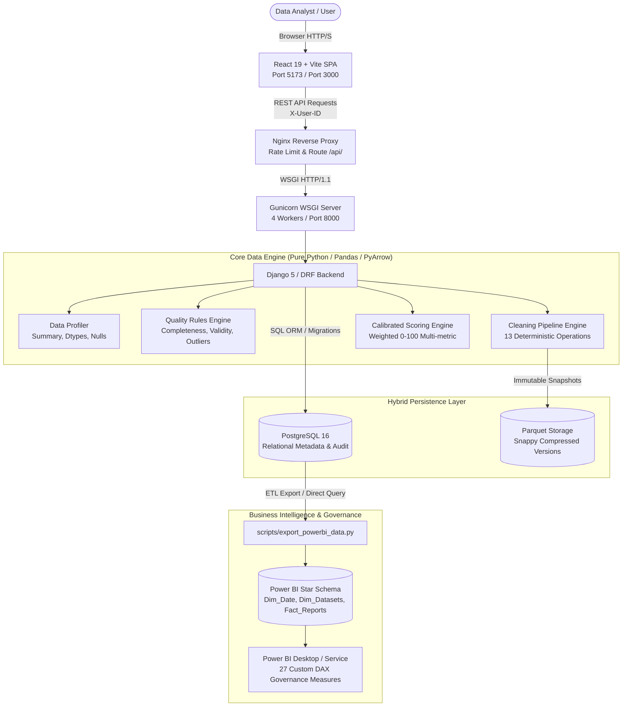
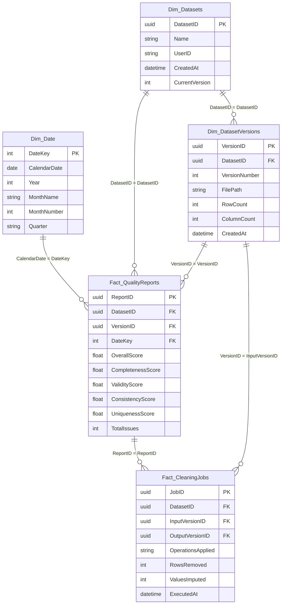

# System Architecture — Data Quality & Cleaning Platform

## 1. High-Level Architecture Overview

The **Data Quality & Cleaning Platform** is built following a clean, decoupled architecture where data processing, metadata persistence, API exposition, user interface, and business intelligence each occupy distinct layers.

---

## 2. Layer-by-Layer Breakdown

### 2.1 Presentation Layer (Frontend)
- **Framework:** React 19 SPA bootstrapped with Vite.
- **Styling:** Custom CSS design system with responsive flexbox/grid, accessible colors, and real-time state alerts.
- **Capabilities:**
  - Drag-and-drop file ingestion (CSV, XLSX, XLS).
  - Real-time quality health scorecards with dimensional breakdown (Completeness, Validity, Consistency, Uniqueness).
  - Automated issue discovery table with severity categorization.
  - Interactive rule selection for deterministic cleaning.
  - Lineage and version comparison inspection (Before vs. After).
  - One-click sanitized CSV and Parquet export.

### 2.2 Ingress & Reverse Proxy Layer
- **Component:** Nginx Alpine container.
- **Responsibilities:**
  - Serves static pre-compiled React production bundles with gzip compression.
  - Acts as a reverse proxy for `/api/*` endpoints to the Django backend.
  - Enforces `client_max_body_size 25M` to mitigate denial-of-service via massive file uploads.
  - Passes client identity, proxy headers (`X-Forwarded-For`, `X-Forwarded-Proto`), and streaming options.

### 2.3 Application & API Layer (Backend)
- **Framework:** Django 5 with Django REST Framework (DRF).
- **WSGI Runner:** Gunicorn with 4 concurrent worker processes.
- **Responsibilities:**
  - **Magic-Byte Validation:** Inspects raw file headers (`PK\x03\x04` for XLSX, OLE2 for XLS, rejection of `MZ` PE and `\x7fELF` binaries).
  - **Path Traversal Sanitization:** Cleans file names of `../`, `..\\`, absolute paths, and null bytes.
  - **IDOR Protection:** Enforces `X-User-ID` dataset ownership verification (`403 Forbidden` if unauthorized).
  - **Stateless REST Endpoints:**
    - `POST /api/datasets/upload/`
    - `GET  /api/datasets/{id}/profile/`
    - `GET  /api/datasets/{id}/quality/`
    - `POST /api/datasets/{id}/clean/`
    - `GET  /api/datasets/{id}/versions/`
    - `GET  /api/datasets/{id}/export/`
    - `GET  /api/health/`

### 2.4 Core Data Quality Engine
- **Technology:** Pure Python, Pandas 2+, NumPy 2+, PyArrow.
- **Components:**
  1. **Profiler (`src/profiler.py`):** Calculates row/column counts, memory footprints, exact null frequencies, and data type inference.
  2. **Quality Engine (`src/quality.py`):** Detects schema violations, null columns, duplicate rows/keys, out-of-range values, categorical mismatches, and Tukey's IQR outliers ($Q_1 - 1.5 \times \text{IQR}$, $Q_3 + 1.5 \times \text{IQR}$).
  3. **Cleaner (`src/cleaner.py`):** Executes 13 deterministic transformations in order (whitespace, column naming, casing, missing imputation, range clamping, deduplication, outlier clipping).
  4. **Scorer (`src/scorer.py`):** Computes calibrated 0–100 quality scores using dimension weights (Completeness: 30%, Validity: 25%, Consistency: 25%, Uniqueness: 20%).

### 2.5 Hybrid Storage Architecture
The platform strictly separates relational metadata from bulk tabular datasets:

| Data Type | Storage Engine | Format | Rationale |
|---|---|---|---|
| **Dataset Metadata** | PostgreSQL 16 / SQLite | Relational Tables | Relational integrity, foreign keys, fast querying, auditability |
| **Audit Logs & Jobs** | PostgreSQL 16 / SQLite | Relational Tables | Step-by-step history of transformations applied |
| **Quality Reports** | PostgreSQL 16 / SQLite | JSONB / Text | Historical score tracking over time and versions |
| **Dataset Versions** | File System / Object Storage | Apache Parquet (Snappy) | High-compression columnar storage, preserves data types precisely |
| **Sanitized Exports** | On-the-fly streaming | CSV / Parquet | Escaped against CSV Formula Injection (`=`, `+`, `-`, `@`, `\t`, `\r`) |

---

## 3. Power BI Governance Star Schema

The platform provides enterprise data quality governance via Power BI using a Star Schema model. Data is synchronized from PostgreSQL using `scripts/export_powerbi_data.py`.

### Key DAX Governance Measures:
- **`[Average Quality Score]`**: Dynamic average across selected datasets and time periods.
- **`[Quality Score Delta]`**: Measure of improvement between Version 1 (Raw) and Version $N$ (Cleaned).
- **`[Unclean Datasets Count]`**: Count of datasets with overall quality score below acceptable governance threshold ($< 70$).
- **`[Total Issues Remediated]`**: Aggregate volume of missing values imputed, outliers clipped, and duplicates purged.

---

## 4. Security Architecture

1. **Defense in Depth Input Validation:**
   - MIME type checking + magic bytes verification for binary header inspection.
   - Rejection of executables (`MZ`, `ELF`).
2. **Formula Injection (CSV Injection) Prevention:**
   - Any string cell starting with `=`, `+`, `-`, `@`, `\t`, or `\r` is escaped with a leading single quote (`'`) upon CSV export.
3. **Identity & Authorization Isolation:**
   - Multi-tenant data segregation using `X-User-ID`.
   - Access control checks reject cross-tenant dataset reads, cleaning executions, and report downloads.
4. **Environment Isolation:**
   - Secrets managed via `.env` and `.env.production` — no secrets or production credentials in version control.
