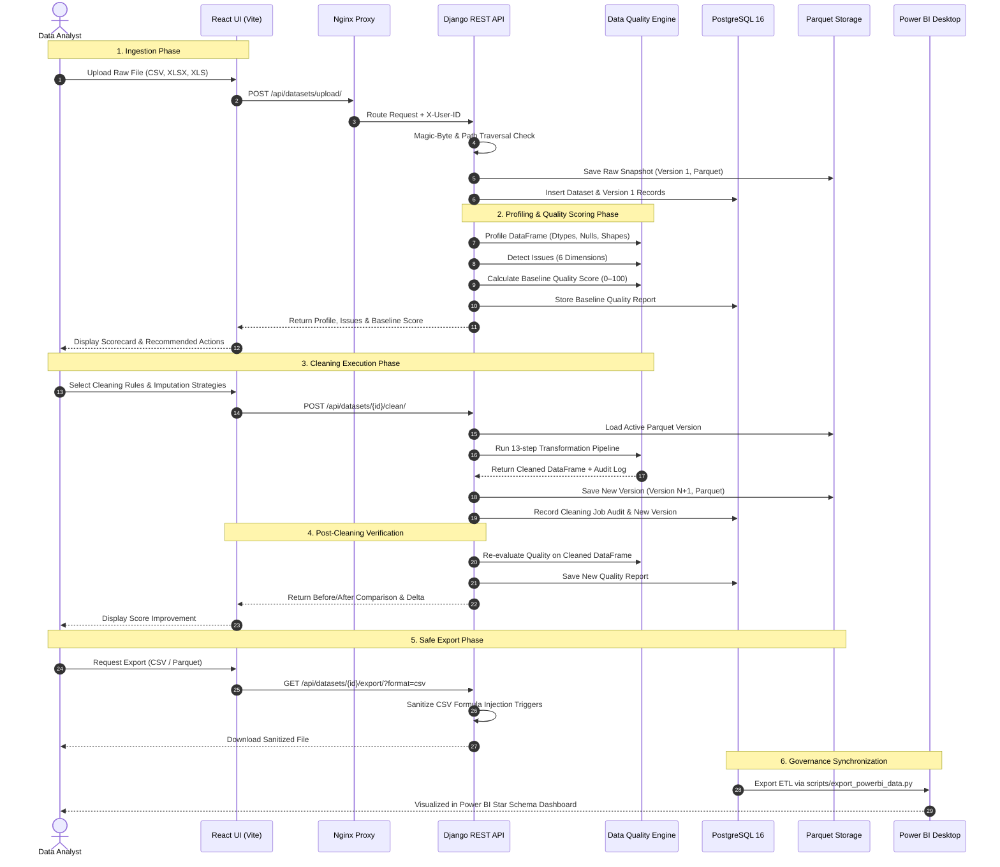

# End-to-End Data Flow — Data Quality & Cleaning Platform

This document describes the complete lifecycle of a dataset within the platform, from raw file upload to automated profiling, quality evaluation, cleaning transformations, version snapshotting, and BI governance consumption.

---

## 1. High-Level Data Flow Sequence



---

## 2. Detailed Phase Breakdown

### Step 1: Secure Ingestion & File Validation
1. **Upload Stream:** The user uploads a file through the drag-and-drop interface.
2. **File Size Enforcement:** Nginx validates the payload size (max 25MB).
3. **Magic-Byte Inspection:**
   - **XLSX:** Validates ZIP header signature `PK\x03\x04`.
   - **XLS:** Validates OLE2 compound document header `\xd0\xcf\x11\xe0\xa1\xb1\x1a\xe1`.
   - **CSV / Text:** Scans leading bytes to ensure it does not contain Windows PE (`MZ`) or Linux ELF (`\x7fELF`) binaries.
4. **Filename Sanitization:** Strips directory separators, absolute paths, and null bytes.
5. **Initial Persistence:**
   - The file is converted into a pandas DataFrame and persisted to local/cloud storage as an immutable Apache Parquet file using Snappy compression.
   - Initial metadata (`Dataset` and `DatasetVersion` v1) is inserted into PostgreSQL.

---

### Step 2: Automated Profiling & Issue Discovery
The Core Engine analyzes the raw dataset across structural and content metrics:
- **Structural Profiling:** Row count, column count, memory usage, inferred vs. native data types.
- **Null Analysis:** Frequency, percentage, and pattern of missing values per column.
- **Duplicate Detection:** Identification of identical rows across all attributes or selected primary identifiers.
- **Outlier Detection:** Detection of numerical values outside $1.5 \times \text{IQR}$ bounds using Tukey’s fence.
- **Categorical & Range Checks:** Identification of values violating domain constraints or inconsistent casing (e.g., `"NY"`, `"ny"`, `"New York"`).

---

### Step 3: Calibrated Quality Scoring
A composite data quality score from `0.0` to `100.0` is computed according to a calibrated multi-dimensional formula:

$$\text{Total Score} = 0.30 \times C + 0.25 \times V + 0.25 \times K + 0.20 \times U$$

Where:
- **Completeness ($C$):** Percentage of populated non-null cells across the dataset.
- **Validity ($V$):** Conformance to expected data types, formats (dates/emails), and ranges.
- **Consistency ($K$):** Casing standardization and categorical alignment.
- **Uniqueness ($U$):** Ratio of unique records vs. duplicate rows ($1.0 - \text{duplicate ratio}$).

---

### Step 4: Deterministic Cleaning Pipeline
Transformations execute sequentially to guarantee reproducible results:

```text
[Input DataFrame]
       │
       ▼
 1. Strip Whitespace (all string cells)
       │
       ▼
 2. Normalize Headers (snake_case, remove illegal characters)
       │
       ▼
 3. Standardize Casing (lower, upper, title per column rule)
       │
       ▼
 4. Categorical Mapping (replace synonyms and anomalies)
       │
       ▼
 5. Parse & Normalize Dates (ISO-8601 YYYY-MM-DD)
       │
       ▼
 6. Numerical Range Enforcement (Clamp or Nullify)
       │
       ▼
 7. Missing Value Imputation (Mean, Median, Mode, or Constant)
       │
       ▼
 8. Deduplication (Purge duplicate rows)
       │
       ▼
 9. Outlier Treatment (Clip to IQR bounds or Nullify)
       │
       ▼
[Cleaned DataFrame]
```

---

### Step 5: Versioning & Audit Lineage
- The cleaned DataFrame is saved as a new version: `v{N+1}.parquet`.
- An audit record is logged in `cleaning_jobs` recording:
  - Exact parameters used for each transformation.
  - Number of rows modified or removed.
  - Number of missing values imputed.
  - Timestamp, runtime duration, and initiating user identity.
- Full lineage is preserved: original raw data is never overwritten.

---

### Step 6: Safe Export
- When a user downloads the cleaned dataset as a CSV, the platform defends against **CSV Formula Injection (CWE-1236)**.
- Any string cell starting with `=`, `+`, `-`, `@`, `\t`, or `\r` is escaped with a leading single quote (`'`), rendering it harmless when opened in spreadsheet software like Microsoft Excel or Google Sheets.

---

### Step 7: Power BI Governance Sync
1. The scheduled or on-demand ETL script `scripts/export_powerbi_data.py` reads metadata and reports from PostgreSQL.
2. It outputs structured CSV dimension and fact tables into `powerbi/data/`.
3. Power BI Desktop ingests these tables through its Star Schema model, recalculating 27 governance DAX measures.
