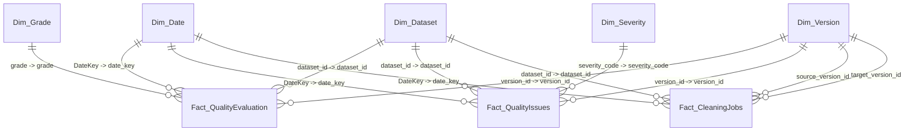

# Power BI Dimensional Data Model Specification

**Phase 9: V9.0 — V9.1**  
**Layer:** Data Quality Governance & Platform Analytics  
**Architecture:** Kimball Star Schema with Conformed Dimensions  

---

## 1. Architectural Philosophy

Power BI connects directly to the platform's analytical metadata—**not** to arbitrary, unstructured user tables. This enables corporate data governance, tracking data health, transformation throughput, and cleaning efficacy across all datasets processed by the organization.

---

## 2. Table Catalog & Granularity

### Dimension Tables

| Table | Grain | Primary Key | Description |
| :--- | :--- | :--- | :--- |
| **`Dim_Dataset`** | One row per uploaded dataset | `dataset_id` | Logical dataset entity, original filename, format, owner, created timestamp. |
| **`Dim_Version`** | One row per version snapshot | `version_id` | Physical Parquet snapshot, version number, row count, file size, latest flag. |
| **`Dim_Date`** | One row per calendar day | `DateKey` | Standard corporate calendar dimension with Year, Quarter, Month, Weekday. |
| **`Dim_Severity`** | One row per defect severity | `severity_code` | Critical, Warning, Informational lookup with risk weighting and brand colors. |
| **`Dim_Grade`** | One row per letter grade | `grade` | A, B, C, D, F rating tiers with min/max score thresholds and trust indicators. |

### Fact Tables

| Table | Grain | Foreign Keys | Metrics / Measures |
| :--- | :--- | :--- | :--- |
| **`Fact_QualityEvaluation`** | One row per quality report evaluated on a dataset version | `date_key`, `dataset_id`, `version_id`, `grade` | `overall_score`, `completeness_score`, `validity_score`, `uniqueness_score`, `consistency_score`, `row_count`, `column_count`, `is_trustworthy` |
| **`Fact_QualityIssues`** | One row per defect/anomaly detected | `date_key`, `dataset_id`, `version_id`, `severity_code` | `affected_count`, `affected_percentage`, `severity_weight` |
| **`Fact_CleaningJobs`** | One row per deterministic cleaning execution | `date_key`, `dataset_id`, `source_version_id`, `target_version_id` | `total_operations`, `rows_modified`, `quality_score_delta`, `rows_removed`, `source_score`, `target_score` |

---

## 3. Power BI Relationships & Cardinality

| From Table (Dimension) | From Column | To Table (Fact) | To Column | Cardinality | Cross Filter | Active |
| :--- | :--- | :--- | :--- | :--- | :--- | :--- |
| `Dim_Dataset` | `dataset_id` | `Fact_QualityEvaluation` | `dataset_id` | 1 : Many (1:*) | Single (`Dim` filters `Fact`) | **Yes** |
| `Dim_Version` | `version_id` | `Fact_QualityEvaluation` | `version_id` | 1 : 1 (or 1:*) | Single | **Yes** |
| `Dim_Grade` | `grade` | `Fact_QualityEvaluation` | `grade` | 1 : Many (1:*) | Single | **Yes** |
| `Dim_Date` | `DateKey` | `Fact_QualityEvaluation` | `date_key` | 1 : Many (1:*) | Single | **Yes** |
| `Dim_Dataset` | `dataset_id` | `Fact_QualityIssues` | `dataset_id` | 1 : Many (1:*) | Single | **Yes** |
| `Dim_Version` | `version_id` | `Fact_QualityIssues` | `version_id` | 1 : Many (1:*) | Single | **Yes** |
| `Dim_Severity` | `severity_code` | `Fact_QualityIssues` | `severity_code` | 1 : Many (1:*) | Single | **Yes** |
| `Dim_Date` | `DateKey` | `Fact_QualityIssues` | `date_key` | 1 : Many (1:*) | Single | **Yes** |
| `Dim_Dataset` | `dataset_id` | `Fact_CleaningJobs` | `dataset_id` | 1 : Many (1:*) | Single | **Yes** |
| `Dim_Version` | `version_id` | `Fact_CleaningJobs` | `target_version_id` | 1 : Many (1:*) | Single | **Yes** |
| `Dim_Version` | `version_id` | `Fact_CleaningJobs` | `source_version_id` | 1 : Many (1:*) | Single | **No** (Inactive; use `USERELATIONSHIP`) |
| `Dim_Date` | `DateKey` | `Fact_CleaningJobs` | `date_key` | 1 : Many (1:*) | Single | **Yes** |

---

## 4. Column Data Types & Modeling Recommendations

### `Dim_Date`
- `DateKey`: **Whole Number** (Integer `YYYYMMDD`)
- `FullDate`: **Date** (`YYYY-MM-DD`). Mark as the official Date Table in Power BI.
- `MonthShort`: Sort by column `MonthNumber`.
- `Quarter`: Sort by column `Quarter`.

### `Fact_QualityEvaluation`
- `overall_score`, `completeness_score`, `validity_score`, `uniqueness_score`, `consistency_score`: **Decimal Number** (Format: `0.0"%"`)
- `is_trustworthy`: **Whole Number** (`1` or `0`)
- `row_count`, `column_count`: **Whole Number** (Format: `#,##0`)

### `Fact_CleaningJobs`
- `quality_score_delta`: **Decimal Number** (Format: `+0.0"%" ; -0.0"%" ; 0.0"%"`)
- `rows_modified`, `rows_removed`: **Whole Number** (Format: `#,##0`)
